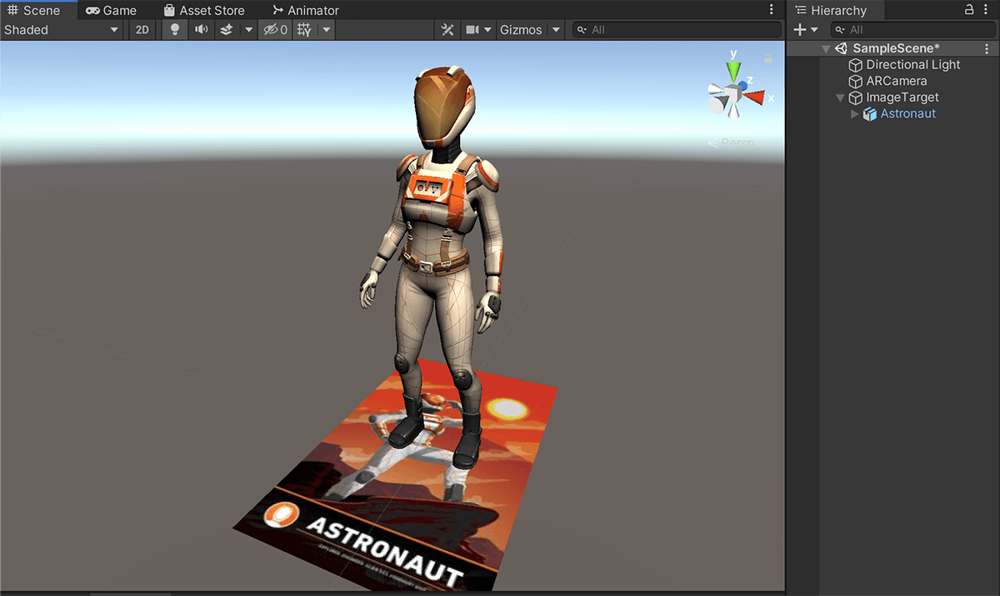

<h3>Image Targets represent images that Vuforia Engine can detect and track. The Engine detects and tracks the image by comparing extracted natural features from the camera image against a known target resource database. So wherever the target is detected the AR objected is projected.</h3>

